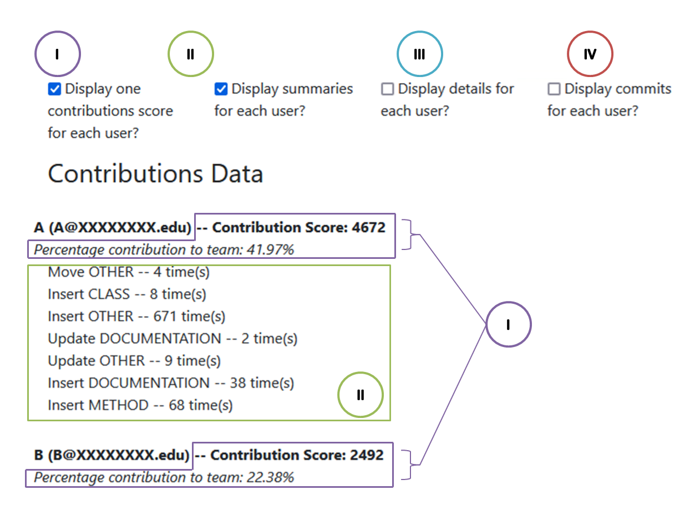

## How it Works

AutoVCS traverses Git commit history to identify what files were changed on each commit.  It then builds ASTs representing adjacent file revisions, and computes an edit script between them to identify detailed changes between adjacent revisions.  These changes are then summarised across files and across commits to produce higher-level summaries of individual students' contributions.

AST analysis implicitly ignores formatting changes, and due to several other improvements (see Implementation Details, below) may serve to offer more useful summaries of students' contributions than just lines of code.

## Algorithm Details

First, we show the contributions summary algorithm at a high level:

First, metadata is extracted from Github (line 2).  This pulls the repository commit history, including commit messages, timestamps, commit authors, and files changed on each commit.

Next, the commit history is traversed (lines 6-20) and for each file changed on a commit (lines 13-18) ASTs are built and differenced.

Finally, individual edit operations are aggregated into higher-level summaries of what individual students have contributted.  This process is shown on line 21, and in more detail in the following figure:

## Contributions Summaries

Contributions summaries are produced at three granularity levels: 

- (I) Single Contributions Score: Each user's contributions are condensed into a single score.  In addition, these scores are used to calculate a percentage contribution for each user.  
- (II) Contributions summaries: These summaries present the counts of _additions_ and _updates_ to each of the categories from above.  Note that _deletions_ are skipped over -- this is perhaps not ideal, because sometimes bugs are fixed by deleting code, but more often we find that significant code is deleted to prepare for a refactoring, and this action doesn't mean much.
- (III) Contributions summaries per file: The same as above, but now changes made are broken down on a per-file basis.  If the teaching staff knows that changes to one ifle are likely particularly difficult, this nuance can help.

Options I and II are shown in the following image:

In addition, a list of commits is shown for each user to account for non-code contributions (IV).

## Implementation Details

### GUI Files
AutoVCS has a toggleable option to skip changes to GUI files, which in our context are provided by the teaching staff, not written by students.  GUI files are (currently) matched just by filename, not content (for example, looking for use of Swing packages).  A file is considered to be a GUI file if the filename (including package) contains `view` or `ui`.

### Boilerplate Code

Our improved version of ChangeDistiller has been modified to skip over four types of boilerplate methods, which are generally auto-generated:
- `hashCode()` and `equals()` methods are exactly matched by name, and always skipped
- `getter` methods are methods whose name matches against the regex `get[a-zA-Z0-9]*\(\)` and where the method body contains only a `return` statement.  Getter methods matching these constraints are not included in the summaries.  If there is any other code, we assume it to be additional logic and the method (and its contents) are included in the summaries produced.
- `setter` methods are methods whose names match against the regex `set[a-zA-Z0-9]*\([^,]*\)` and which contain only a single variable assignment statement.  Setter methods matching these constraints are not included in the summaries.  If there is any other code, we assume it to be additional logic and the method (and its contents) are included in the summaries produced.

### Contribution Weights

The following weights are used when calculating individual scores, and for grouping changes:

  - Class: 100 points
  - Method: 25 points
  - Field (in a class, not individual variable declarations): 10 points
  - Documentation (including JavaDoc, /* */, and // comments): 1 point
  - All other changes

These categories and weights are inspired by a simplified version of change types proposed by Gall et al.'s "Change analysis with evolizer and ChangeDistiller"