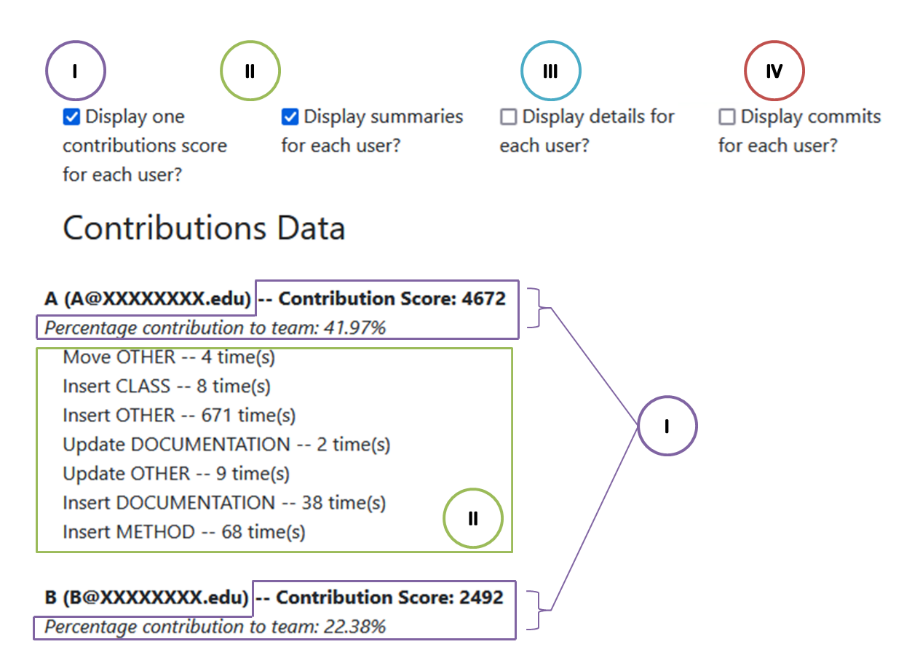

# AutoVCS

AutoVCS is an application that presents summaries of individual developers' code contributions to team-based projects.  We envision that this may be particularly helpful for helping TAs and instructors grade student projects.

AutoVCS is written in Java, and can present summaries for Java code contributions tracked through GitHub (either Github.com, or Github Enterprise).  AutoVCS has the following requirements:
- Java 8+ (tested working on Java 8 and Java 11)
- MySQL or MariaDB (tested with MariaDB 10.3 and MySQL 8.0)
- Our [improved version](https://github.com/AutoVCS/ChangeDistiller) of ChangeDistiller [1].

Rather than simply reporting the number of lines of code added/removed by each developer, such as Github Insights offers, AutoVCS performs program analysis on (Java) code, and by considering code syntax, can offer richer insights.  We present as an example a contributions summary produced by AutoVCS:

Details explaining I-IV are shown on the [algorithm](AutoVCS-Algorithm.md) page.

Interested in seeing how AutoVCS can work for you?  Check out [Getting Started](Getting-Started.md).  Interested in seeing our algorithm for summarising individual contributions?  Check out the [algorithm](AutoVCS-Algorithm.md) details.  Want to use AutoVCS to support grading in your class?  Check out our [suggested workflow](Using-AutoVCS.md).

## Contributing

We welcome bug reports and feature requests!  

If you are interested in contributing new code, please reach out to see if the feature you are considering is already underway.

## References

[1] Beat Fluri, Michael Würsch, Martin Pinzger, and Harald C. Gall. Change Distilling: Tree Differencing for Fine-Grained Source Code Change Extraction. IEEE Transaction on Software Engineering, 33(11), pp. 725-743, 2007.
