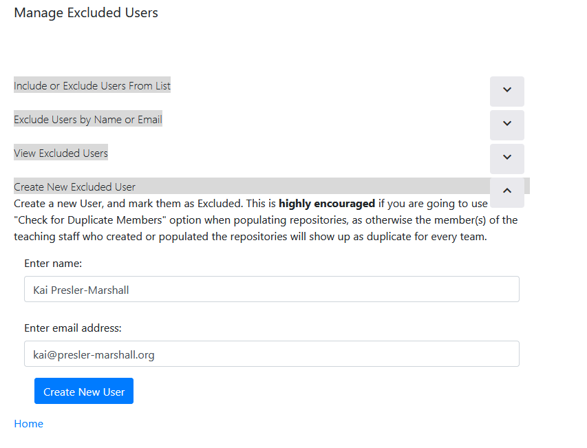
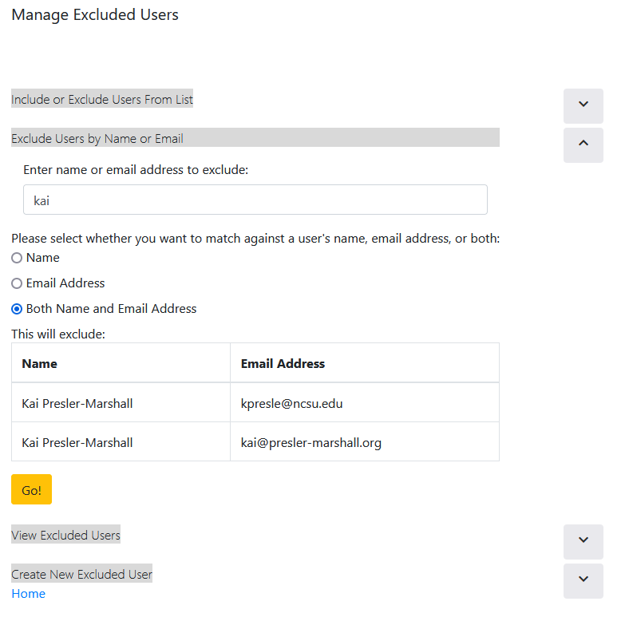
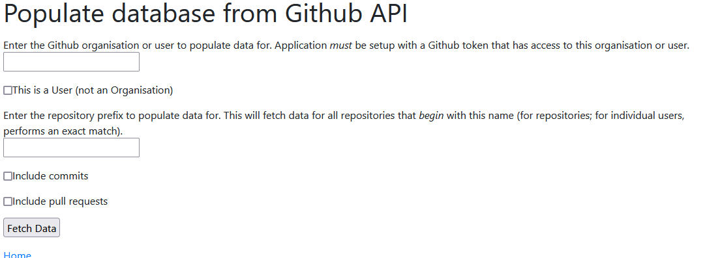
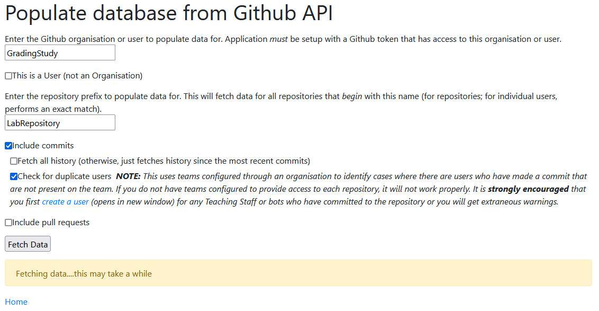
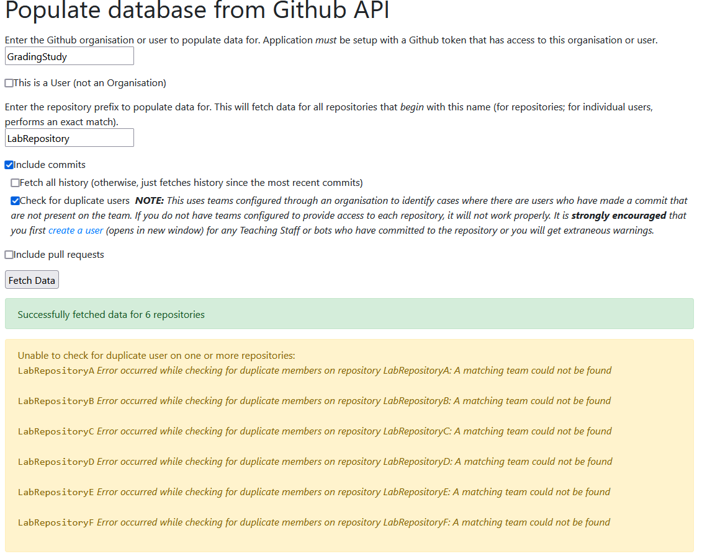
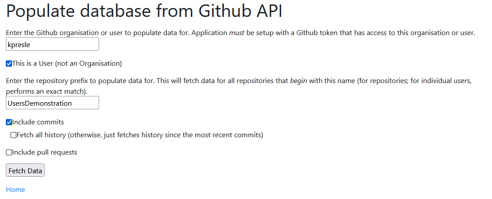
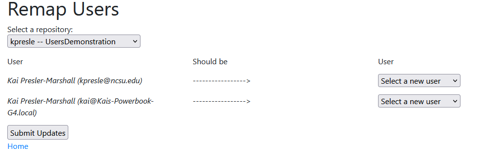
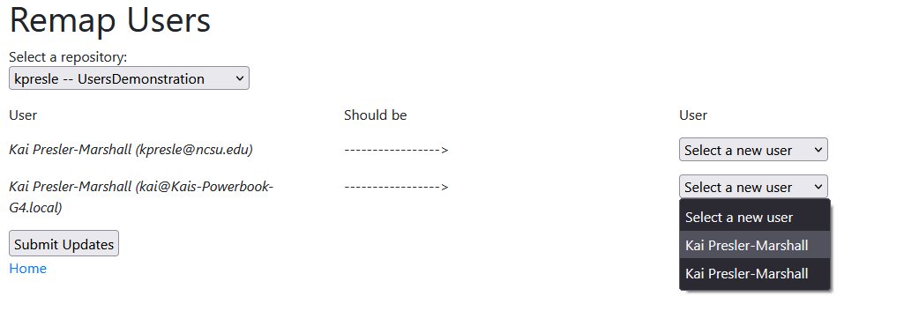

# Using AutoVCS

We're excited that you're considering using AutoVCS to support grading!

We suggest the following workflow, with each step illustrated in more detail below:

- Configure AutoVCS properties (one-time)
- Create Excluded User[s]
- Populate Git Metadata
- Fix Duplicate Users
- Flag Pair Programming (_coming soon!_)
- Create Contributions Summaries

## Configure AutoVCS Properties

Take a look at the Getting Started page for instructions on [how to configure](Getting-Started.md#configuration) AutoVCS.  This only needs to be done once.

## Create Excluded Users

In our workflow, student repositories are bulk-created by members of the course teaching staff.  However, this means that all repositories include a single commit from the teaching staff, which interferes with automated summaries.  If you use Github Actions, or [dependabot](https://github.blog/2020-06-01-keep-all-your-packages-up-to-date-with-dependabot/), there may be commits from bots in your commit history, which can also interfere with things.  

To address this, AutoVCS has the ability to _exclude_ users from further analysis.  

If you know precisely what users you want excluded, you can create a user profile for these users and pre-exclude them:

For this to work properly, you must know (exactly, including capitalisation & whitespace) the name and email address for any user(s) you want to exclude.  If you don't know exactly who you want to exclude, you can instead populate data for one repository (see [below](Using-AutoVCS#populate-git-metadata)) and then exclude users the system now knows about:

## Populate Git Metadata

Git data is stored in a local database to facilitate handling duplicate users and to guide the rest of the analysis process.

From the main page, click "Populate Github Data":

Next, fill in information on the organisation & repository that you want to fetch data for:

If an error occurs checking for duplicate users, you will be notified of teams where the process failed:

As explained below, you can still manually check for and fix duplicate users on these repositories as desired.

For repositories where duplicate users were found, there is a link to each one to fix the duplicate users (see below):

You can also populate data for repositories belonging to an individual user, not an organisation:

## Fix Duplicate Users

In order to ensure that users are accurately credited for all of their contributions, we suggest that you fix duplicate user profiles.  These cases occur when students configure their local Git profiles with a name and email address that does not match what they use on Github Enterprise (or Github.com), and is exacerbated by students who work on multiple computers where profiles may be misconfigured.  Git is [very trusting](https://github.com/jayphelps/git-blame-someone-else).

As shown above, for repositories configured through an organisation where repository access is managed by Github Teams, you can have AutoVCS check for duplicate users automatically.  In this case, a repository is flagged as containing duplicate users if it contains _any_ user who has made a commit to the repository but who is not on the associated Team for the repository.  If you are coming directly from a link on the Populate Github Data, the repository to fix users will be selected automatically.

If you are not using Teams, you can also check for duplicate users manually and reassign them.  Select the repository desired from the dropdown:

Now, you can remap any user you want to any other user on the repository.  The dropdown to the right of each user contains all users on the repository, shown in the same order as on the page itself.  For example:

This will let us collapse the two copies of Kai Presler-Marshall together; in particular, it will update all commits from `Kai Presler-Marshall (kai@Kais-Powerbook-G4.local)` to be authored by `Kai Presler-Marshall (kpresle@ncsu.edu)` instead.  **Note**, this only updates the local database, and changes are not propagated to Github, and the Git commit history itself is not rewritten.

Behaviour when attempting circular remappings (for example, all commits from User A to B, and all from User B to User A) is not defined.

## Flag Pair Programming 

_this featue is currently under development, please check back in the future_ :)

## Create Contributions Summaries